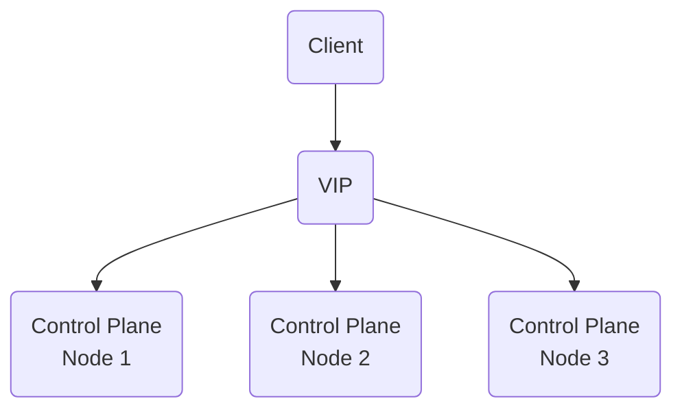
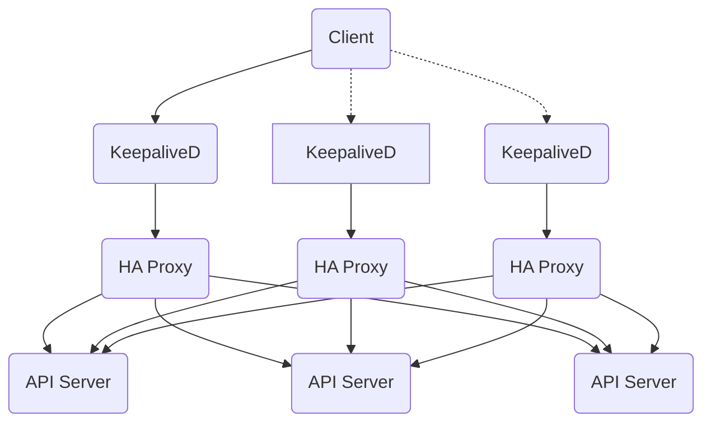

# Overview

This is an overview of the cluster's current networking topology.

```mermaid
graph LR
  Ext(Internet)-->GW(Gateway)
  GW.->|VLAN30|NW1(Client Network)
  GW.->|VLAN45|NW2(Cluster Network)
```

The `Gateway` component performs its typical role of router as well as firewall and governs perimiter access into my network and between network segments.

The following table describes the current network and CIDR allocations

Network | CIDR
------- | ----
Client Network | `192.168.30.0/24`
Cluster Nodes  | `192.168.45.0/24`
Cluster Pod Subnet | `10.244.0.0/18`
Cluster Service Subnet | `10.244.64.0/20`

The cluster network is implemented as an overlay (non-encapsulated) network between `Cluster Nodes` and no direct Layer3 access to the Pod or Service Subnets is possible. To expose services in the cluster to the `Client Network` and `Internet` the cluster implements Ingress/Egress controllers exposing `type: loadBalancer` services on the `Cluster Nodes` network.

## Highly Available Control Plane

In typical higly available control plane clusters an external VIP provider is used to provide connectivity to the control plane API servers. Since this cluster is considered *bare metal* an alternative solution is required.



> Typical HA Control Plane Topology

This cluster is configured as a stacked control plane and uses a software based solution to create the necessary components to provide a fault-tolerate control plane access layer. These components are `keepalived` - used to advertise the Layer2 IP address for the *VIP*, `haproxy` - the *load balancer* that proxies `API Server` traffic between the 3 control plane nodes. `keepalived` and `haproxy` are deployed as *static pods* whos manifests are deployed at cluster init. The configuration generally looks like so;



> It's important to note that, as currently configured, `keepalived` only moves the VIP between nodes when it can no longer detect network connectivity. This means if the node is up, `keepalived` is available.
